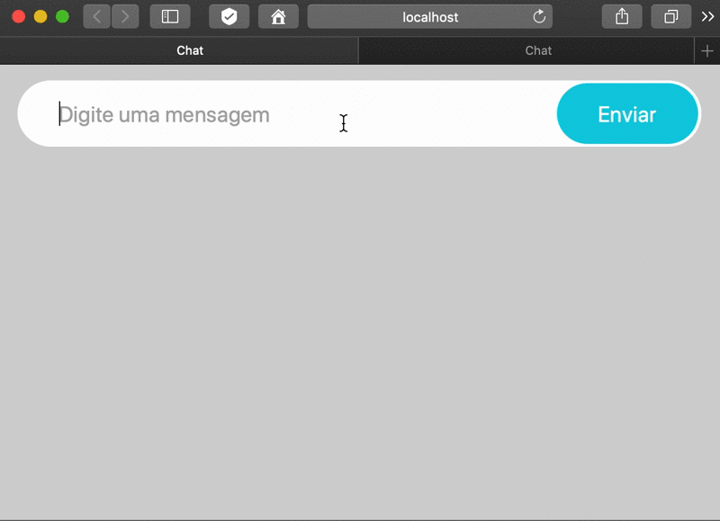

:source-highlighter: highlightjs
:numbered:
:icons: font

ifdef::env-github[]
:outfilesuffix: .adoc
:caution-caption: :fire:
:important-caption: :exclamation:
:note-caption: :paperclip:
:tip-caption: :bulb:
:warning-caption: :warning:
endif::[]

= Aplicação de Mensagens Instantâneas utilizando WebSocket com Node.js (link:https://kinolien.github.io/gitzip/?download=/manoelcampos/sd-websockets/tree/master/2.1-websocket-chat-nodejs[zip])

NOTE: Acesse uma Playlist de vídeos mostrando todo o processo de desenvolvimento da aplicação https://www.youtube.com/watch?v=hEPAr4MPQjU&list=PLyo0RUAM69UvnqUq5SFeVahS_YTUVgq4v[aqui].

Web chat utilizando http://nodejs.org:[Node.js]. Com Node.js podemos usar JavaScript no lado servidor. A aplicação utiliza http://websocket.org[WebSockets (recurso do HTML5)] com a biblioteca http://socket.io para implementar o chat.

A biblioteca socket.io apenas facilita o uso do recurso de WebSocket.
WebSocket é um protocolo https://pt.wikipedia.org/wiki/Duplex#Full-duplex[full-duplex] leve para transmissão de dados em aplicações web.
Se tal biblioteca for usada em uma aplicação web em Node.js, quando é feita uma conexão WebSocket ao servidor, todo o extenso cabeçalho e corpo de uma mensagem HTTP é trafegado pela rede. Depois que a conexão é realizada,
ela fica estabelecida com o servidor e, a partir daí, somente os dados enviados pela aplicação
(normalmente digitados pelo usuário) e um pequeno cabeçalho (usualmente de apenas https://tools.ietf.org/html/rfc6455#section-5.2[32 bits]) serão enviados ao servidor.

Apesar de ser possível abrir uma conexão HTTP e mantê-la aberta para requisições
subsequentes, cada requisição trafega o cabeçalho e corpo das mensagens HTTP, aumentando
o tráfego de rede e tempo para recebimento de respostas.
No Firefox, podemos monitorar o tráfego HTTP e ver a quantidade de dados trafegados
por meio do menu Ferramentas >> Web Developer >> Network (F12).

No Chrome devemos acessar o botão `...`, depois `More Tools >> Developer Tools >> Network` (F12).
Na mesma aba, na parte inferior, podemos ver os frames WebSocket enviados
e como tais frames são pequenos.

Para aplicações web de tempo real como jogos, mensagens instantâneas e edição colaborativa de documentos, o uso de conexões leves como WebSockets reduz problemas de escalabilidade geográfica e escalabilidade de tamanho (número de usuários).

Com WebSockets, diferente de uma aplicação web tradicional usando HTTP,
o servidor pode enviar dados para um cliente conectado, sem que o cliente primeiro requisite tais dados.
Isto faz todo o sentido nas aplicações descritas acima, onde um usuário conectado pode receber dados de outro usuário, mesmo sem ter solicitado tais dados (um usuário pode estar conectado e receber uma mensagem de outro, sem ele ser obrigado à enviar uma requisição ao sevidor para solicitar o recebimento de tais dados).

Este projeto baseado no exemplo disponível no https://socket.io/get-started/chat/[site do socket.io].

== Estrutura do Projeto

- link:server.js[server.js]: representa a aplicação Node.js que permitirá aos clientes (por meio do navegador) interagirem no chat.
- link:package.json[package.json]: representa o arquivo de configuração da aplicação servidora. Ele foi criando por meio de um assistante, digitando-se `npm init` no terminal. As dependências (bibliotecas utilizadas pela aplicação) foram baixadas e salvas em tal arquivo digitando-se `npm i express socket.io`. No entanto, como o `package.json` já está configurado, não é preciso executar estes dois comandos.
- link:index.html[index.html]: página web que será disponibilizada aos clientes quando eles acessarem o 
                               servidor por meio do navegador. Tal página representa a parte cliente
                               do chat. Por meio dela os usuários podem interagir entre si, utilizando
                               o servidor como intermediário.
- link:Makefile[Makefile]: arquivo que pode ser executado com o comando `make` no Linux/macOS para instalar as ferramentas necessárias. Ver seção de instalação abaixo. É interessante abrir tal arquivo para descobrir quais comandos estão sendo executados ao realizar o processo de instalação (como descrito a seguir).
                    
== Instalação 

O projeto usa o http://nodejs.org:[Node.js] para rodar o servidor e o http://npmjs.com:[npm] para gerenciar pacotes utilizados pela aplicação (como por exemplo, para baixar tais pacotes diretamente pelo terminal). 

Opcionalmente, pode-se usar o https://nodemon.io:[nodemon] para permitir monitorar alterações no código do servidor e reiniciá-lo automaticamente. Isto facilita muito o desenvolvimento pois não temos que parar o servidor manualmente cada vez que fizermos uma alteração no código.

A seguir é mostrado como instalar tais ferramentas automaticamente no macOS, Linux e Windows.

=== macOS

Para instalar as ferramentas no macOS, pode-se baixar o gerenciador de pacotes homebrew.
A https://brew.sh[página oficial] mostra logo no topo a única instrução necessária para isto.
Após instalar o homebrew, basta abrir um terminal no diretório raiz do projeto e executar `make macos`.

=== Linux

Para instalar as ferramentas acima em Linux baseados em Debian (como Ubuntu e derivados), 
basta abrir um terminal no diretório raiz do projeto e executar `make linux`.
No entanto, se ao executar o comando ocorrer erro indicando que o programa make não foi encontrado,
execute um `sudo apt-get install make`.

=== Windows

Os comandos acima são para Linux e macOS. 
Se você usa Windows, pode baixar manualmente o http://nodejs.org[Node.js] que os comandos npm descritos anteriormente
possivelmente vão funcionar sem precisar de configurações adicionais.

Mas se você quiser usar os mesmos comandos Linux da seção anterior
(e ter disponíveis vários outros comandos existentes em Linux),
pode baixar o https://docs.microsoft.com/en-us/windows/wsl/install-win10[Windows Subsystem for Linux].
Depois disso, basta seguir os passos da seção anterior.

=== Dependências da aplicação servidora

Os pacotes (dependências) que são utilizados pela aplicação servidora são salvos na pasta `node_modules`. Esta pasta não é incluída e pode ser removida a qualquer momento (uma vez que podemos usar um comando para baixar os pacotes novamente). Assim, para baixar tais pacotes em tal pasta, basta executar `make install`.

== Executando a Aplicação

=== Servidor

Para iniciar o servidor, podemos executar:

[source, bash]
----
npm start
----

Porém, utilizando o nodemon, basta fazer `nodemon` que ele vai procurar um arquivo `server.js` e iniciá-lo automaticamente.

=== Cliente

Após iniciar o servidor, ele vai mostrar no terminal o endereço que a aplicação pode ser acessada pelo navegador (cliente).
O endereço padrão é http://localhost:8000.
Cada aba ou janela do navegador aberta em tal endereço representará um usuário do chat.

== Aplicação Cliente sem o uso da biblioteca socket.io

A biblioteca socket.io facilita bastante a criação de aplicações clientes e servidoras que usem o protocolo WebSocket.
No entanto, ao usar tal biblioteca, a interoperabilidade de tais aplicações é prejudicada.
Logo, fazer uma aplicação cliente que não usa socket.io se comunicar com um servidor socket.io é mais complicado.
Isto pode ser percebido ao analisar o código da página link:websocket.html[websocket.html].
Esta é uma aplicação cliente que pode ser aberta simplesmente dando dois cliques no arquivo.
Ela necessita que o servidor implementado aqui esteja em execução.
Tal aplicação cliente usa os recursos de WebSockets nativos dos navegadores modernos,
sem nenhuma biblioteca externa. 

== Hospedagem da Aplicação em Provedor de Nuvem

Para podermos testar a aplicação remotamente, ela foi hospedada
no https://heroku.com[Heroku], um provedor de nuvem que fornece serviços que chamamos de Platform as a Service (PaaS). Tal provedor fornece gratuitamente uma plataforma para implantação (deploy) de aplicações, de modo que todo o processo de instalação das ferramentas necessárias para a execução da aplicação é automatizado e não temos que nos preocupar com nada disso.
Isto inclui a instalação de: 

- ferramentas de execução (máquinas virtuais para Java, Node.js, Python, PHP, etc); 
- servidores web e de aplicação; 
- bibliotecas que tais aplicações utilizam.

O Heroku é um serviço fantástico por se integrar com o GitHub.
Ele detecta quando enviamos alterações para um repositório no GitHub (com git push), baixa o código e implanta a aplicação.
Se tivermos aplicações em Java e outras linguagens que precisam ser compiladas, ele automatiza todo esse processo.
Obviamente, seu projeto deve estar corretamente configurado, usando ferramentas de gerenciamento de dependências/automação
de build como Maven e npm (este último que estamos usando aqui).

Como esta aplicação é desenvolvida utilizando Node.js, o Heroku identifica isso pela existência do arquivo package.json e assim criar todo um ambiente de execução de aplicações Node pra gente.

A aplicação está hospedada em https://chatwss.herokuapp.com.
